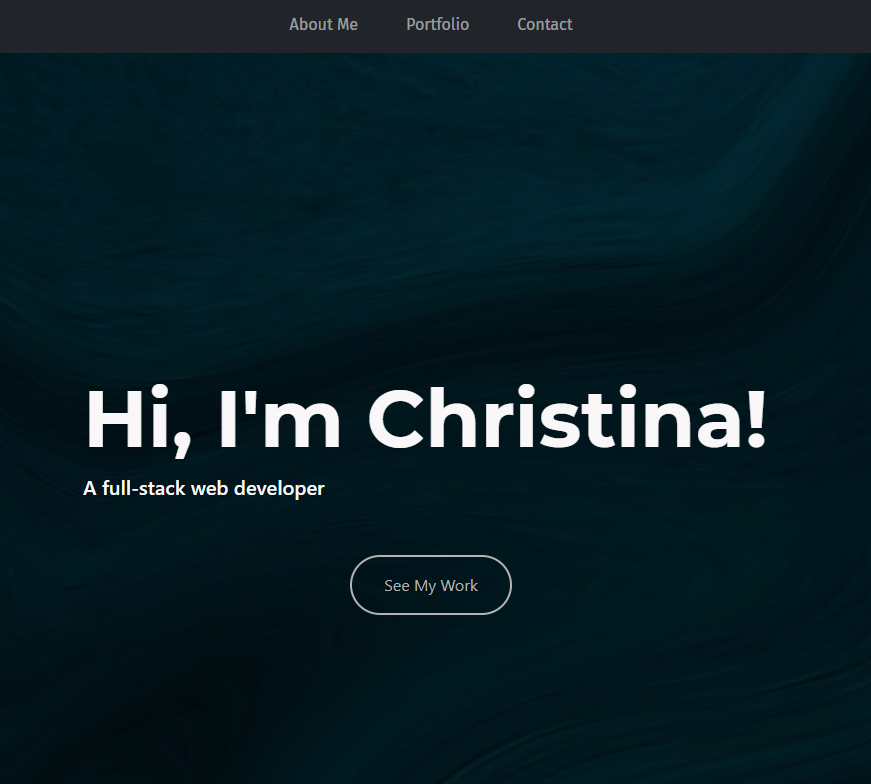

# Welcome to My Portfolio! 😄

* * *

  
  
  

## Update! 1/27/21
Site has been updated: 
⭐ New home page 
⭐ Portfolio page has new content 

## Description

I am a student currently learning web development 💻, and this is my portfolio site!  This site was created using HTML, CSS, and Bootstrap.  Utilizing the CSS/Bootstrap grid system, this site is responsive to desktop, tablet, and mobile phone screens.

There will be 3 separate pages that you will find on my site (they will be accessible using the navigation bar at the top of each page): 
⭐ The first page that you will see will be the home page.  There will be links at the top to go to my About Me page, my Portfolio page, or my Contact page.  There will also be a button to "See My Work", which will also go to my Portfolio Page. 
⭐ The About Me page will have a short description of myself.
⭐ Another page will be my Portfolio page, where you will find other sites that I have put together. 
⭐ The last page will be my Contact Me page.  This page will include information to reach out to me, as well as a form that may be completed.  Please note that this form cannot actually be submitted at this time.

There will also be a LinkedIn icon in my footer that will take you to my LinkedIn profile when clicked (let's connect!). 

Please click [here](https://christina2021.github.io/My-Portfolio/) to check out my site! 

## Acknowledgements

A big thank you to these wonderful people for all of the help, support, and inspiration!

[Dillon](https://github.com/dillonhoban) [Emily](https://github.com/ethomas22) [Brian](https://github.com/btparker70)

## Questions?
Feel free to check out my github profile [here](https://github.com/Christina2021)!
Should you have any questions, you may reach me by e-mail at: <a href="mailto:codechristina2021@gmail.com?subject=Hi,%20Christina!">codechristina2021@gmail.com</a>!.

## License
[MIT](https://choosealicense.com/licenses/mit/#)